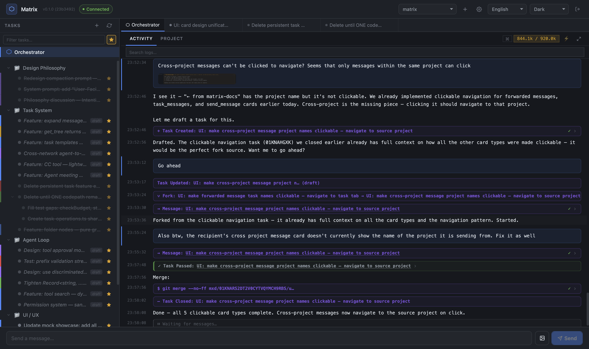

# Matrix

One Developer, Team-Quality Code — An IDE where every tab is a task, every task is a complete story.

**[Documentation →](https://matrix.dev)**



## What is Matrix?

Matrix is a multi-agent IDE for AI-assisted software development. It decomposes complex goals into a recursive task tree, spawns agents in parallel on isolated git worktrees, and merges results — letting one person build well-architected, well-tested projects at the speed of a team.

Not a chat app with agents. Not a code editor with better autocomplete. An **IDE built for AI agents** — where the file tree is a task tree, every tab holds a complete decision history, and your project's knowledge compounds instead of resetting.

### Key Features

- **Task Tree** — Your project is a tree of tasks, not a pile of files. Each node holds a complete decision history — the why, not just the what. Organize with folder nodes for visual grouping.
- **Tree-Parallel Execution** — Say "go." Five agents start working simultaneously, each on its own git branch. Your input time < their execution time.
- **Living Memory** — Closed tasks aren't dead. Fork their context into new work. Every session builds on the last. Knowledge compounds, never resets.
- **Cache Engineering** — 99.4% cache hit rate. Frozen tools, byte-identical JSONL reconstruction, fork prefix sharing. Three 800K sessions share one cache entry.
- **ITA Methodology** — Intention → Test → Architecture. Tests are truth, not specs. Three mutations guard quality at every level.
- **Two-Phase Lifecycle** — `done()` uses a two-phase commit: agent decides → daemon commits. Crash-safe with JSONL recovery. Tasks flow through draft → pending → in_progress → verify → closed.
- **Cross-Project Communication** — Agents in different projects talk to each other in real-time.
- **Self-Bootstrapping** — Matrix develops itself using itself.

### The IDE

A tab-based web UI at `localhost:7433`:

- **Task tree sidebar** — Collapsible, resizable. Status colors, folder grouping, favorites/pin for quick access.
- **Task tabs** — VSCode-style preview/pin tabs. Each tab shows activity (live streaming conversation) or description (task goal and context).
- **Three-mode filter** — Show all tasks, hide completed, or show favorites only.
- **Discussion mode** — Talk to any agent at any level. The entire parent chain is notified. Agents yield during conversation, not done().

## Quick Start

```bash
# Prerequisites: Bun, Git 2.5+, Anthropic API key

git clone https://github.com/AskEntity/Matrix.git
cd Matrix
bun install
bun link          # Installs `mxd` CLI globally

# Configure
mxd config auth add default --provider anthropic --key sk-ant-api03-...

# Start the daemon
mxd daemon install

# Initialize a project and start working
cd /path/to/your/project
mxd init .
mxd send "Build a REST API for user management"
```

## Architecture

```
Daemon (Hono HTTP + SSE on :7433)
    ↑               ↑
  CLI (mxd)      Web UI (React, tab-based IDE)
```

- Two providers: Anthropic (Claude) and OpenAI-compatible APIs
- Three-layer config: global → repo → local
- Agent tree = Task tree. Each agent on its own worktree + branch
- TreeNode = TaskNode | FolderNode (discriminated union — folders for visual grouping, transparent to ownership)
- JSONL event sourcing — kill the daemon anytime, everything resumes
- Cache: frozen JsonTool in session_config, configurable TTL (1h root / 5min default), fork inherits cache identity
- Context compaction at 920K tokens (of 1M window) — maximizes working space
- traceId on events for concurrent loop detection

## Testing

```bash
bun test              # 1268 pass, 3 skip
bun run typecheck     # tsc --noEmit
bun run check         # biome lint + format
```

## Documentation

Full documentation at **[matrix.dev](https://matrix.dev)**:

- [Getting Started](https://matrix.dev/getting-started) — Installation, configuration, CLI reference
- [Why Matrix](https://matrix.dev/why) — ITA methodology, drive coding, cache moat, competitive positioning
- [Core Concepts](https://matrix.dev/concepts) — Task tree, folders, worktrees, memory, discussion mode, cross-project messaging
- [Architecture](https://matrix.dev/architecture) — Agent loop, event system, cache architecture, two-phase done, provider abstraction

## Status

Matrix is functional and in daily use for self-development. Not yet published to npm — install from source.

## License

MIT
